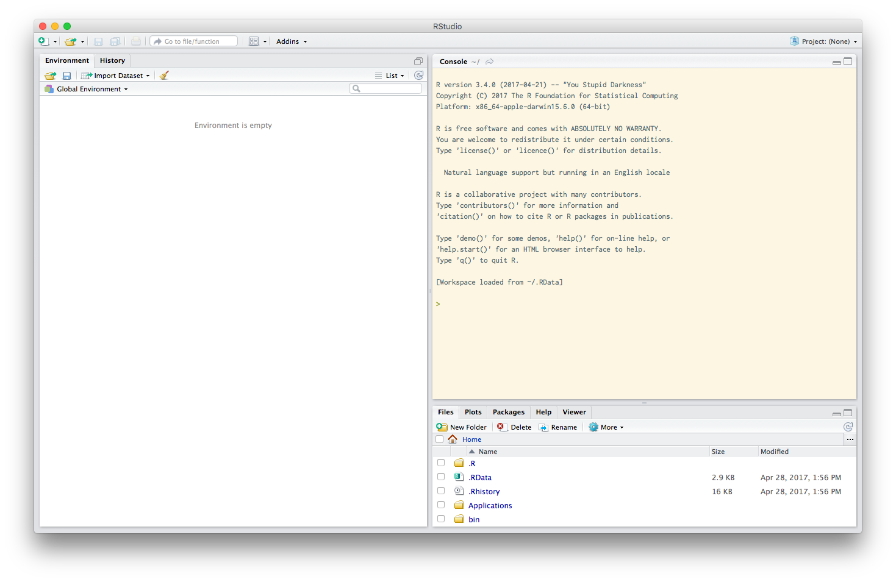

## Data analysis and visualization in R for transportation

R is an open-source computer programming language primarily designed for data
analysis and statistics; through its extensive community of user-contributed
packages, it is one of the most popular and accessible platforms for beginning
and advanced data science. This laptops-open tutorial will introduce modern
data science practices and tools to novice analysts – those more accustomed to
spreadsheet software and having little to no programming experience.

Data Carpentry's aim is to teach researchers basic concepts, skills,
and tools for working with data so that they can get more done in less
time, and with less pain. The lessons below were designed for those interested
in working with {{page.domain %}} data in {{page.topic %}}.

This is an introduction to R designed for participants with no programming
experience. These lessons can be taught in an hour and a half tutorial. They start with some
basic information about R syntax, the RStudio interface, and move through how to
import CSV files, the structure of data.frame, how to deal with factors, how to
add/remove rows and columns, and finish with how to calculate summary statistics
for each level and a very brief introduction to plotting. Normal Data Carpentry
tutorials are taught over a day. This material is signficantly shortened.


**Content Contributors: {{page.contributors | join: ', ' %}}**


**Lesson Maintainers: {{page.maintainers | join: ', ' %}}**


**Lesson status: {{ page.status }}**

<!--
  [Information on Lesson Status Categories]()
-->

<!-- ###### INDEX OF LESSONS ON THIS TOPIC ###### -->


## Requirements
Data Carpentry's teaching is hands-on, so participants are encouraged to use
their own computers to insure the proper setup of tools for an efficient
workflow.

*These lessons assume no prior knowledge of the skills or tools*, but working
through this lesson requires working copies of the software described below.
To most effectively use these materials, please make sure to install everything
*before* working through this lesson.

You will need to have installed the following applications:

  - *R* is open-source statistical software. Install the latest version from
  [CRAN](https://cran.r-project.org/), for
  [macOS](https://cran.r-project.org/bin/macosx/) or for
  [Windows](https://cran.r-project.org/bin/windows/). When the installer has downloaded, follow the default installation instructions.  
  - *R Studio* is an open-source application that makes R easier to use.
  Download the most recent free desktop installer (not the zip/tarball) for
  your platform from <https://www.rstudio.com/products/rstudio/download/>.
  Follow the default installation instructions.

Open RStudio from your applications folder or menu. You should see something
like the image below. The colors and locations of things may be different, and
can be configured to your preferences in `Tools/Global Options...`



At this point, we need to install a few packages. Packages are bundles of
code that R developers publish to make their jobs easier; anyone can publish
packages to CRAN, and then other R users can use and improve them.

Place your cursor in the console, and enter the following line:

```r
install.packages("tidyverse")
```

and press enter. R will then take the next several minutes downloading,  
installing, and testing the [`tidyverse`](http://tidyverse.org/) collection of
packages commonly used in data science. Now that these packages are installed,
you can load their functions into your workspace with the line below.

```r
library(tidyverse)
## Loading tidyverse: ggplot2
## Loading tidyverse: tibble
## Loading tidyverse: tidyr
## Loading tidyverse: readr
## Loading tidyverse: purrr
## Loading tidyverse: dplyr
## Conflicts with tidy packages
## ----------------------------------------------------------------------
## filter(): dplyr, stats
## lag():    dplyr, stats
```

The messages that R prints to the screen tell you which packages were loaded.
In this tutorial you will use `readr` to read data into R from your hard disk,
`dplyr` and `tidyr` to munge your data, and `ggplot2` to plot and visualize your
data. The conflicts message tells you that when you loaded `dplyr`, two
functions included with R, `filter` and `lag`, were replaced with versions in
the `dplyr` library.

Once you have successfully installed the tidyverse, you are ready to use
R for data science.


## Lessons
Two data files are required for this lesson:
[nhts_day.csv](http://psrc.github.io/itm-tutorial-R/data/nhts_day.csv) and
[nhts_per.csv](http://psrc.github.io/itm-tutorial-R/data/nhts_per.csv). These
only include the first 200 lines of the full National Household Travel Survey
files. Download the files and keep them in an accessible place on your hard  
drive. You will place them in the proper place in the tutorials.

  1. [Lesson 00 Before we start](00-before-we-start.html): A motivation to use
  R, and how to set up your working environment.
  2. [Lesson 01 Introduction to R and dplyr](01-new-intro-R.html): How to use R
  to calculate statistics on data structures, including complex data tables.
  3. [Lesson 02 Data visualization with ggplot2](02-visualization-ggplot2.html):
  How to use R to produce graphics and plots.
  4. [Lesson 03 Using censusr](03-censusr.html): Downloading data directly from
  the US Census Bureau into R [bonus if time allows].
